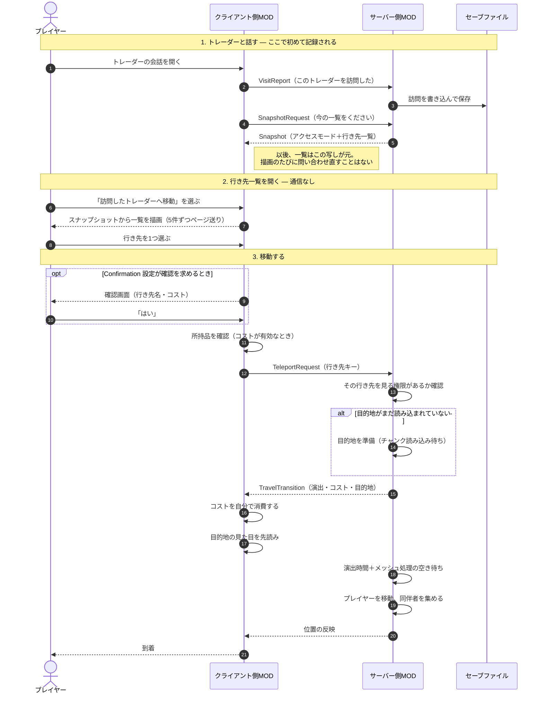
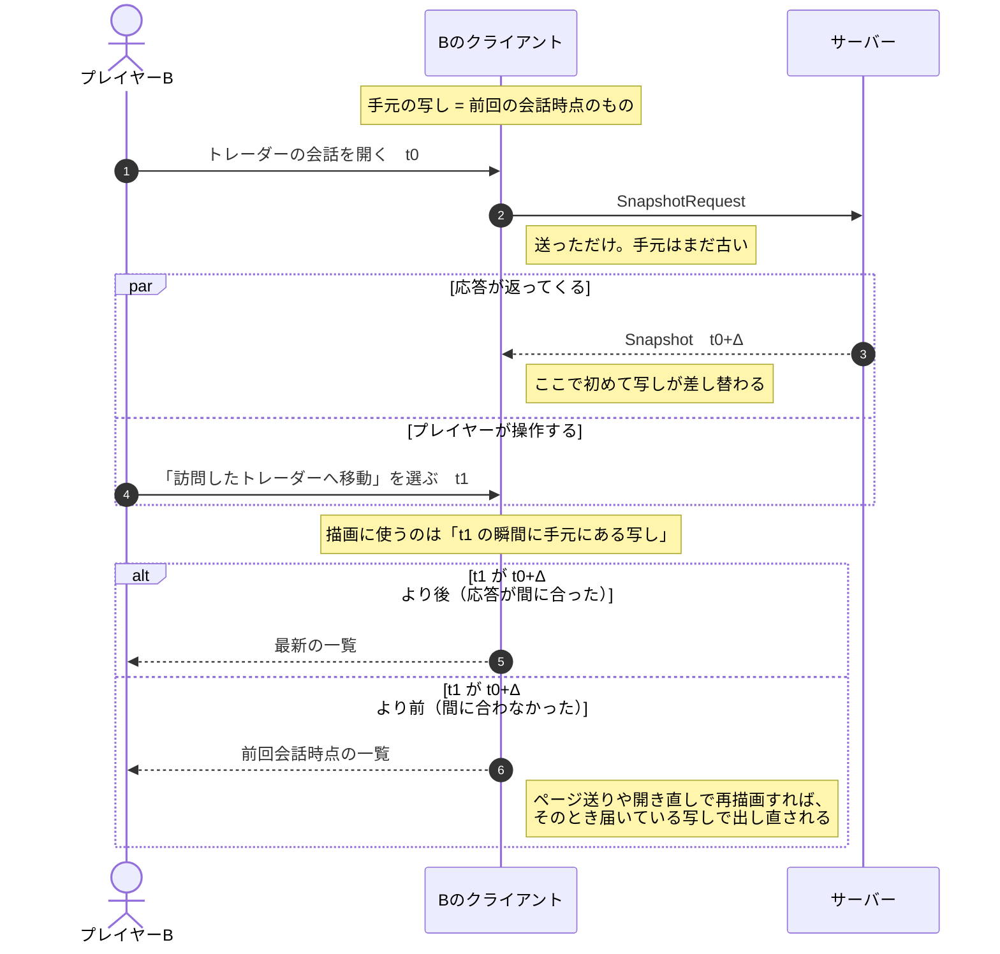
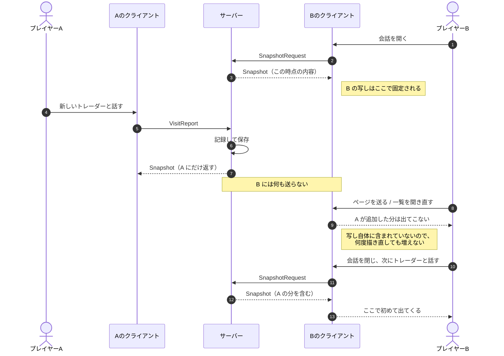

# マルチプレイ時の通信フロー

## サーバーに接続して遊ぶときのやり取り

クライアントがトレーダーと話してから、行き先へ移動するまでの時間軸。矢印はすべて実際のネットパッケージ。

### タイミング — いつ最新になり、いつならない

一覧は「サーバーへの問い合わせ」ではなく「手元に持っている写し」を描いています。写しが差し替わるのは会話を開いたときに送る要求への応答が届いた瞬間だけで、**描画側は応答の到着を待ちません**。ここから2つの別々の現象が出ます。

#### 現象1: 応答と操作の競合（プレイヤーB の中だけで起きる）

他プレイヤーは関係ありません。B 自身の通信往復と、B 自身の操作速度の競合です。

**救えるのはこちらだけです。** 描画のやり直し（ページ送り・一覧を開き直す・行き先を選んで戻る）はそのつど写しを読み直すため、応答が届いていれば次の描画で反映されます。

#### 現象2: 写しが「その時点のもの」であること（競合ではなく確定的な挙動）

サーバーから他プレイヤーへの配信はありません。スナップショットの送信先は**常に要求してきた本人だけ**です。

**タイミングの偶然ではありません。** 要求がサーバーで処理された後に他プレイヤーが追加したものは、同じ会話の中では何をしても出てきません。恒久的に増えないわけではなく、「B が次にトレーダーと話すまで遅れる」が正確な表現です。共有モードで複数人が同時に探索しているときに効いてきます。

### なぜこの方式のままでよいか

上の2つを見ると「サーバーから配信すべきでは」と考えたくなるが、検討した結果**現状の取得方式のままとする**。理由を残しておく（同じ疑問から同じ検討を繰り返さないため）。

**行き先の判定はシビアではない。** 一覧に到達する唯一の経路がトレーダーとの会話で、その会話のたびに取り直している。したがって最悪でも「一手遅れる」だけで、恒久的にずれることはない。行き先が消えたり、間違った場所へ飛んだりする類の問題ではない。

**配信を足しても窓はゼロにならない。** 各プレイヤーに見える範囲は `(データ, アクセスモード, パーティ所属)` の関数で、データ変化に反応するだけでは足りない。パーティへの参加・離脱はデータを変えないまま見える範囲を変えるため、データ変化を契機にした配信では捕まえられない。捕まえるにはパーティ変化のフックが要るが、取れる保証がない。

なお切断は影響しない。共有モードは `database.VisitsByPlayer` の全件を見ており、接続中かどうかを見ていないため、誰が落ちても一覧は変わらない。

**現状の方式は、すべての入力を一点で拾い直している。** 会話開始時の取得は、データ変化・パーティ変化・再接続のいずれであっても、次の会話という一点でまとめて反映する。取りこぼしの経路を個別に塞ぐ必要がない、という意味で素直な作りになっている。

データ量は行き先10件で約900バイト、30件でも約2.5KB。転送そのものが問題になることはない（1件あたり約84バイト＋固定部約65バイト）。

### 読み取れること

**一覧は「写し」であって問い合わせではない。** 行き先一覧を開いてもサーバーには何も飛ばない。描画元は最後に受け取ったスナップショット。サーバーがスナップショットを送るのは4か所（訪問報告・スナップショット要求・移動要求・削除要求）で、**いずれも要求してきた本人にだけ**返す。他プレイヤーへの配信は一切ない。詳細は上の「タイミング」を参照。

**記録と可否判定はサーバーが持つ。** 訪問記録の実体はサーバー側のセーブファイルだけ。移動要求を受けたサーバーは、そのプレイヤーがその行き先を見てよいかをアクセスモードに沿って確認してから動く。削除も同じで、対象プレイヤーは要求の中身ではなく**送信元**から特定されるため、他人の記録を指定する余地がない。

**移動コストはクライアントが自分で払う。** コスト機能を有効にした場合、支払えるかの確認も実際の消費もクライアント側で行われる。サーバーは金額を演出パッケージに載せて渡すだけで、検証も徴収もしていない（サーバー側の徴収処理はホスト本人にしか走らない）。通常のプレイでは問題にならないが、改造クライアントは無料で移動できる。

**会話の画面はクライアントだけが持つ。** ダイアログの追加項目はクライアント側のパッチで、サーバーは関与しない。したがってサーバーのMODが古い／入っていなくても選択肢は表示される。

### ネットパッケージ

IDは希望値。埋まっていた場合は空きを探して割り当てるため、導入MOD構成によってはクライアントとサーバーで一致しないことがある。

| ID | パッケージ | 向き | 役割 |
|---|---|---|---|
| 240 | VisitReport | C → S | トレーダーの会話を開いたことを報告する |
| 241 | SnapshotRequest | C → S | 今の行き先一覧を要求する |
| 242 | Snapshot | S → C | アクセスモードと、そのプレイヤーが見てよい行き先一覧 |
| 243 | TeleportRequest | C → S | この行き先へ移動したい |
| 244 | TravelTransition | S → C | 移動を承認した。演出の設定と、支払う額を伝える |
